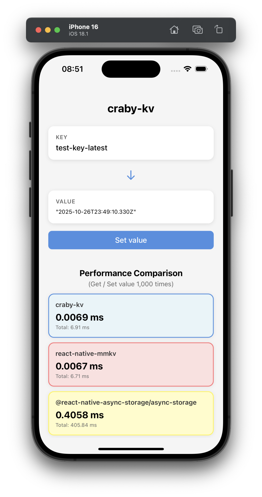

# craby-kv

Demo library for [Craby](https://github.com/leegeunhyeok/craby)

## Overview

```rust
// Rust implementation
use sled::Db;

pub struct CrabyKv {
    ctx: Context,
    bucket: Option<Bucket<'static, Raw, Raw>>,
}

impl CrabyKv {
    fn get_db(&self) -> &Db {
        self.db.as_ref().expect("Database not initialized")
    }
}

impl CrabyKvSpec for CrabyKv {
    fn initialize(&mut self) -> Void {
        self.db = Some(
            sled::open(
                Path::new(&self.ctx.data_path)
                    .join("craby_sled")
                    .to_string_lossy()
                    .to_string(),
            )
            .expect("Failed to open database"),
        );
    }

    fn clear(&mut self) -> Void {
        self.get_db().clear().expect("Failed to clear database");
    }

    fn contains(&mut self, key: &str) -> Boolean {
        self.get_db()
            .contains_key(key)
            .expect("Failed to check if key exists")
    }

    fn get(&mut self, key: &str) -> Nullable<String> {
        match self.get_db().get(key) {
            Ok(Some(v)) => Nullable::<String>::some(String::from_utf8_lossy(&v).to_string()),
            Ok(None) => Nullable::<String>::none(),
            Err(e) => throw!("Failed to get value: {}", e.to_string()),
        }
    }

    fn keys(&mut self) -> Array<String> {
        self.get_db()
            .iter()
            .map(|v| String::from_utf8_lossy(&v.expect("Failed to get item").0).to_string())
            .collect::<Array<String>>()
    }

    fn remove(&mut self, key: &str) -> Void {
        self.get_db().remove(key).expect("Failed to remove key");
    }

    fn set(&mut self, key: &str, value: &str) -> Void {
        self.get_db()
            .insert(key, value.as_bytes())
            .expect("Failed to insert value");
    }

    fn size(&mut self) -> Number {
        self.get_db().len() as Number
    }
}
```

```ts
// Usage
import { KV } from 'craby-kv';

KV.initialize();
KV.set('key', 'Hello, world!');
KV.get('key'); // 'Hello, world!'
KV.contains('key'); // true
KV.keys(); // ['key']
KV.size(); // 1
KV.remove('key');
KV.clear();
```



## Installation

```bash
npm install craby-kv
```

## License

[MIT](LICENSE)
